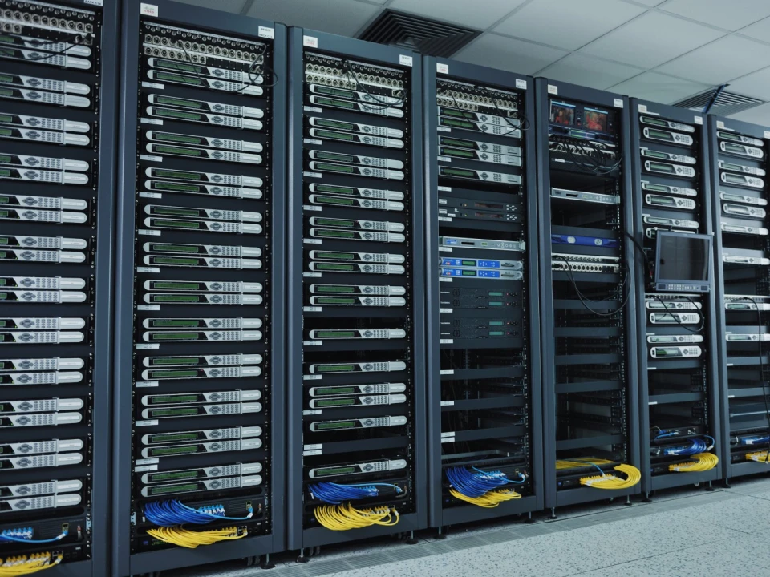
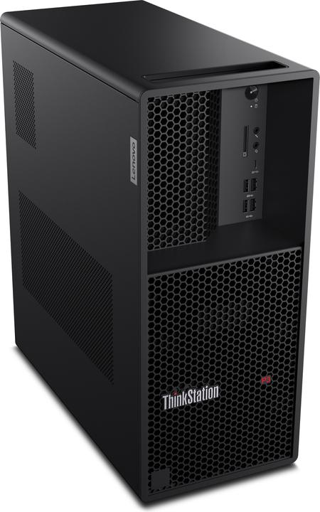
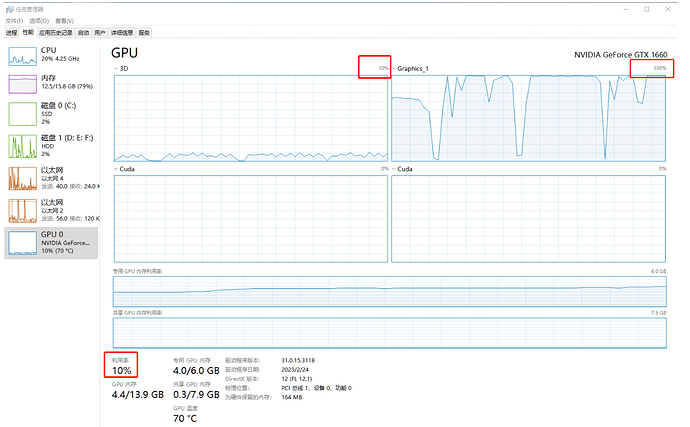
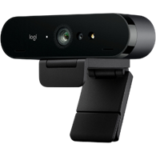
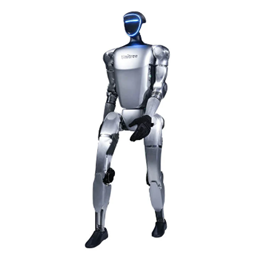
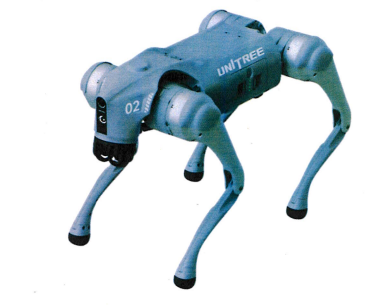
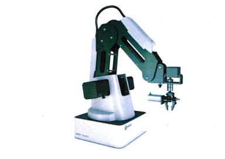
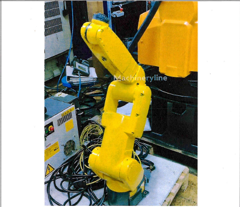
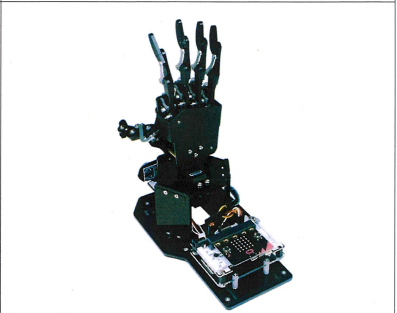

<div align="center">

# 🤖 Лаборатория ИИ и Робототехники
## Инвентаризация оборудования и руководство по использованию


*Подробная документация по оборудованию лаборатории и правилам эксплуатации*

</div>

---

## 🏢 Обзор лаборатории

Лаборатория искусственного интеллекта и робототехники предоставляет современную исследовательскую инфраструктуру для:

- **🤖 Робототехники и автономных систем** — планирование движения, управление, взаимодействие человек–робот  
- **👁️ Компьютерного зрения и восприятия** — 3D-реконструкция, обнаружение объектов, анализ глубины  
- **🧠 Искусственного интеллекта и машинного обучения** — обучение моделей и инференс  
- **🌐 Пограничных вычислений и IoT** — обработка данных в реальном времени  

---

## 🖥️ Центральный AI-сервер (Инфраструктурный обзор)

<table>
<tr>
<td width="65%" valign="top">

> ⚠️ **Уведомление по инфраструктуре**  
> Прямой доступ к серверному оборудованию разрешён только администраторам системы.

### Назначение
AI-сервер — это **централизованная вычислительная платформа**, используемая для:
- Обучения моделей ИИ
- Масштабного инференса
- Обработки данных
- Серверных сервисов для робототехнических и vision-систем

### Взаимодействие с пользователем
Пользователи работают с сервером **только удалённо**:
- Доступ по SSH
- Удалённый рабочий стол или веб-интерфейсы
- Запуск заданий и вычислительных задач

### Управляемые компоненты
Следующие компоненты обслуживаются администраторами и **не требуют действий пользователя**:
- Серверный корпус и стойка
- CPU и GPU
- Оперативная память и хранилища
- Питание и системы охлаждения

📌 По вопросам доступа обращайтесь к администратору лаборатории.

</td>
<td width="35%" align="right">

</td>
</tr>
</table>

---

## 🖥️ Рабочие станции (x10) — ThinkStation P3 Tower Gen 2

<table>
<tr>
<td width="65%" valign="top">

### Назначение
Рабочие станции являются **пользовательскими машинами разработки**, предназначенными для:
- Разработки программного обеспечения
- Экспериментов с ИИ и машинным обучением
- Обработки и визуализации данных
- Подключения к центральному AI-серверу

Каждая станция оснащена выделенным GPU.

---

### Кто может использовать
- Студенты  
- Исследователи  
- Разработчики  
- Сотрудники лаборатории с утверждёнными проектами  

</td>
<td width="35%" align="right">

</td>
</tr>
</table>

<table>
<tr>
<td width="65%" valign="top">

### Начало работы
1. Включите рабочую станцию  
2. Войдите в **Windows 11 Pro**  
3. Запустите инструменты разработки (VS Code, Python, Docker и др.)  
4. Выполняйте локальные задачи или подключайтесь к серверу  

---

### Возможности пользователя
- Написание, запуск и отладка кода  
- Запуск GPU-ускоренных приложений  
- Обучение и тестирование моделей ИИ  
- Визуализация данных  
- Доступ к сетевым ресурсам  

</td>
<td width="35%" align="right">

</td>
</tr>
</table>

<table>
<tr>
<td width="65%" valign="top">

### Проверка доступности GPU
```powershell
```powershell
nvidia-smi

import torch
print(torch.cuda.is_available())
```

### Примечания
- Немедленно сообщайте о любых аппаратных или программных неисправностях
- Всегда соблюдайте правила эксплуатации лаборатории и требования техники безопасности

</td> 
<td width="35%" align="right">
 
</td> </tr> </table>

## 👁️ Стереокамера — Intel RealSense D455

<table>
<tr>
<td width="65%" valign="top">

### Назначение
Intel RealSense D455 — это **стереокамера с измерением глубины**, используемая для:
- Обхода препятствий
- 3D-сканирования и реконструкции
- Компьютерного зрения с учётом глубины
- Систем восприятия в робототехнике

</td> 
<td width="35%" align="right">
 
</td> </tr> </table>
    

<table>
<tr>
<td width="65%" valign="top">

### Порядок использования
1. Подключите камеру по USB  
2. Установите Intel RealSense SDK  
3. Запустите ваше приложение или скрипт  
4. Получайте RGB- и depth-потоки через API  

</td>
<td width="35%" align="right">
 
</td> </tr> </table>


### Пример базового кода (RGB-поток)
```python
import pyrealsense2 as rs
import numpy as np
import cv2

pipeline = rs.pipeline()
pipeline.start()

while True:
    frames = pipeline.wait_for_frames()
    color_frame = frames.get_color_frame()
    if not color_frame:
        continue

    image = np.asanyarray(color_frame.get_data())
    cv2.imshow("RealSense RGB", image)

    if cv2.waitKey(1) == 27:
        break

pipeline.stop()
cv2.destroyAllWindows()
```

---

## 🤖 Человекоподобный робот — Unitree G1

<table>
<tr>
<td width="65%" valign="top">

### Назначение
**Unitree G1** — это **человекоподобный исследовательский робот**, используемый для:
- Исследований мобильности и передвижения
- Управления балансом и движением
- Взаимодействия человек–робот
- Проведения передовых экспериментов в робототехнике

---

### Уведомление по безопасности ⚠️
- Эксплуатируйте робота только в специально отведённых зонах
- Соблюдайте безопасную дистанцию во время движения
- Никогда не блокируйте суставы и исполнительные механизмы
- Кнопка аварийной остановки должна быть всегда доступна

---

### Взаимодействие пользователя с роботом
Пользователи управляют роботом с помощью:
- Официального программного обеспечения
- SDK и API
- Предустановленных сценариев движения

---

### Порядок начала работы
1. Установите робота на устойчивую поверхность  
2. Включите питание робота  
3. Подключитесь к управляющей сети  
4. Запустите управляющее ПО или SDK  
5. Выполните проверку системы перед началом движения  

</td>
<td width="35%" align="right">

</td> </tr> </table>

### Пример базового управления
```python
robot.stand()
robot.walk_forward(steps=3)
robot.turn(angle=30)
```

---

## 🐕 Четвероногий робот — Unitree Go2

<table>
<tr>
<td width="65%" valign="top">

### Назначение
**Unitree Go2** — это **четвероногая роботизированная платформа**, предназначенная для:
- Исследований и обучения в области робототехники
- Экспериментов с автономной навигацией
- Тестирования ИИ-алгоритмов восприятия и передвижения
- Взаимодействия человек–робот

---

### Уведомление по безопасности ⚠️
- Используйте робота только на ровных поверхностях без препятствий
- Держите руки подальше от движущихся ног
- Используйте аварийную остановку при необходимости
- Не эксплуатируйте робота рядом с лестницами и краями платформ

---

### Взаимодействие пользователя с роботом
Пользователи управляют роботом с помощью:
- Официального управляющего приложения
- Интерфейса SDK / API
- Предустановленных режимов движения

---

### Порядок начала работы
1. Установите робота на устойчивую поверхность  
2. Включите питание  
3. Подключитесь через управляющее программное обеспечение  
4. При необходимости выполните калибровку  
5. Выберите режим движения или автономный режим  

</td>
<td width="35%" align="right">
 
</td> </tr> </table> 

### Пример базового движения
```python
robot.stand()
robot.walk_forward(distance=2.0)
robot.turn(angle=45)
robot.stop()
```


---

## 🦾 Роботизированный манипулятор

<table>
<tr>
<td width="65%" valign="top">

### Назначение
**Роботизированный манипулятор** предназначен для:
- Научно-исследовательских и опытно-конструкторских работ
- Тестирования алгоритмов управления движением
- Задач захвата и манипулирования объектами
- Интеграции с системами компьютерного зрения и ИИ
- Автоматизации повторяющихся операций

---

### Основные функции
- Точное позиционирование в пространстве
- Захват, перемещение и укладка объектов
- Программируемые траектории движения
- Ручной и автоматический режимы работы

---

### Меры безопасности ⚠️
- Не размещайте руки в рабочей зоне во время работы манипулятора
- Используйте аварийную остановку при необходимости
- Надёжно закрепите манипулятор на рабочей поверхности
- Проверяйте допустимую нагрузку перед началом работы

---

### Взаимодействие пользователя
Управление манипулятором осуществляется через:
- Программный интерфейс (SDK / API)
- Ручное управление (режим обучения / jog)
- Предустановленные сценарии движения

---

### Начало работы
1. Надёжно закрепите манипулятор на устойчивой поверхности  
2. Подключите питание и интерфейсы управления  
3. Запустите управляющее программное обеспечение  
4. Выполните калибровку осей  
5. Выберите режим работы (ручной или автоматический)  

</td>
<td width="35%" align="right">
 
</td> </tr> </table> 

### Пример базового управления
```python
arm.move_to(x=0.3, y=0.2, z=0.15)
arm.open_gripper()
arm.move_to(x=0.3, y=0.2, z=0.05)
arm.close_gripper()
arm.move_to_home()
```

---

## 🤖 Промышленный робот — FANUC LR Mate 200iC/5L (контроллер R-30iA)

<table>
<tr>
<td width="65%" valign="top">

### Модель
- **Робот:** FANUC LR Mate 200iC/5L  
- **Контроллер:** FANUC R-30iA

---

### Назначение
**FANUC LR Mate 200iC/5L** — это компактный промышленный робот, предназначенный для:
- Исследований в области автоматизации
- Промышленного обучения и образования
- Операций pick-and-place
- Сборочных работ и перемещения материалов
- Роботизированных задач с использованием систем машинного зрения

---

### Ключевые возможности
- Шестиосевой шарнирно-сочленённый робот-манипулятор
- Высокая точность и повторяемость
- Версия с увеличенным радиусом действия (5L)
- Совместимость с системами машинного зрения и внешними датчиками
- Поддержка офлайн- и онлайн-программирования

---

### Взаимодействие с пользователем
Управление роботом осуществляется с помощью:
- Пульта обучения FANUC (Teach Pendant)
- Контроллера FANUC R-30iA
- Робот-программ, написанных на языках **TP** или **KAREL**
- Опциональной интеграции с ПЛК и системами технического зрения

---

### Базовый рабочий процесс
1. Включите контроллер R-30iA  
2. Снимите аварийную остановку  
3. Выберите режим работы (Teach / Auto)  
4. Переместите робот в нужные позиции (jog-режим)  
5. Запишите точки с помощью Teach Pendant  
6. Запустите или протестируйте программу робота  

</td>
<td width="35%" align="right">
 
</td> </tr> </table> 

### Пример — Простая логика Pick & Place (концептуально)
```text
MOVE TO HOME
MOVE TO PICK POSITION
CLOSE GRIPPER
MOVE TO PLACE POSITION
OPEN GRIPPER
RETURN TO HOME
```


---

## 🦾 Набор роботизированного манипулятора (механическая рука с контроллером)

<table>
<tr>
<td width="65%" valign="top">

### Тип
- **Категория:** Учебный / исследовательский роботизированный манипулятор  
- **Конфигурация:** Модульная механическая рука с контроллером управления  

---

### Назначение
Данный **набор роботизированного манипулятора** предназначен для:
- Обучения и подготовки в области робототехники
- Изучения управления движением и кинематики
- Прототипирования решений автоматизации
- Тестирования алгоритмов захвата и манипулирования объектами

---

### Ключевые возможности
- Многозвенная шарнирная механическая рука
- Управление на базе контроллера
- Поддержка сервоприводов или шаговых двигателей
- Поддержка сменных исполнительных механизмов  
  (захват, вакуумная присоска, инструменты)
- Возможность расширения с помощью датчиков  
  (концевые выключатели, камеры, датчики силы)

---

### Взаимодействие с пользователем
Пользователи взаимодействуют с манипулятором через:
- Специализированную плату контроллера
- Подключение к ПК (USB / Serial)
- Программирование на Python, C/C++ или Arduino-подобном коде
- Ручное и программное управление суставами

---

### Базовый порядок работы
1. Подключите манипулятор к контроллеру  
2. Включите питание системы  
3. Инициализируйте начальные положения суставов  
4. Управляйте суставами вручную или через программное обеспечение  
5. Установите и настройте исполнительный механизм  
6. Выполните заданные последовательности движений  

</td>
<td width="35%" align="right">
 
</td> </tr> </table> 

### Пример — Базовое управление суставами (концептуально)
```text
SET joint1 = 45°
SET joint2 = 30°
SET joint3 = 15°
OPEN gripper
MOVE to target position
CLOSE gripper
```

---

<div align="center">

## 🏁 Конец документации


---

</div>
